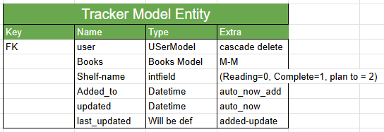
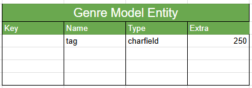
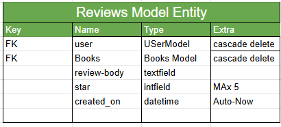
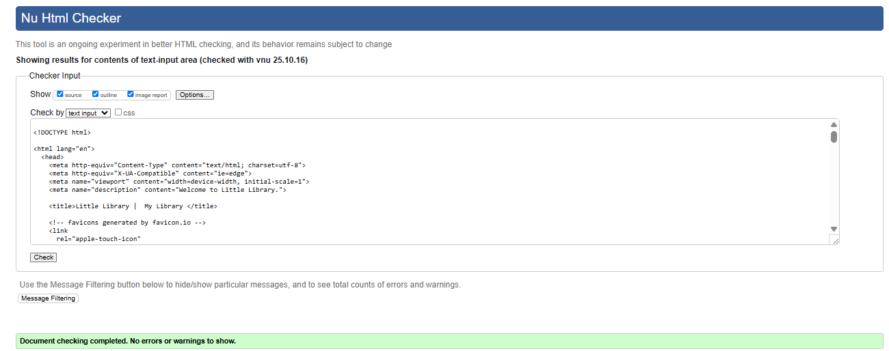
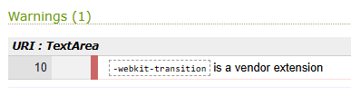

# Little Library


[Live Website](https://little-libraries-5596411363a4.herokuapp.com/)  
[GitHub Repository](https://github.com/DaniqueJ-R/milestone_project_4)

---

## About

Little Library is a minimalist, full-stack web application celebrating the joy of reading and sharing stories. Inspired by the community spirit of neighborhood book exchanges, it allows users to explore a growing collection of books, discover new favorites, and connect over a shared love of literature.

Each book entry includes comprehensive details such as title, author, description, and publication date, making browsing intuitive and informative. Built with accessibility and simplicity in mind, Little Library offers a calm, welcoming space where readers can discover and track beloved books without barriers.

With secure data management, responsive design, and an intuitive interface, Little Library aims to make finding your next great read both easy and inspiring.

---

## Table of Contents

- [About](#about)
- [User Experience](#user-experience)
  - [Strategy](#strategy)
  - [Scope](#scope)
  - [Structure](#structure)
  - [Skeleton](#skeleton)
  - [Surface](#surface)
- [Features](#features)
- [Testing](#testing)
  - [Validator Testing](#validator-testing)
  - [Browser Testing](#browser-testing)
  - [Manual Testing](#manual-testing)
  - [Performance Testing](#performance-testing)
  - [Future Enhancements](#future-enhancements)
- [Development Notes](#development-notes)
  - [Project Overview](#project-overview)
  - [Features Implemented](#features-implimented)
  - [Features Removed/Postponed](#features-removedpostponed)
- [Bug Fixes & General Improvements](#bug-fixes-general-improvements)
  - [Resolved Issues](#resolved-issues)
  - [Current Issues](#current-issues-)
- [Security Improvements Applied](#security-improvements-applied)
- [Notes for Future Developers](#notes-for-future-developers)
- [Future Development Roadmap](#future-development-roadmap)
- [Demo Account](#demo-account)
- [Deployment Guide](#deployment-guide)
- [Credits](#credits)

---

## User Experience

### Strategy

This site is designed for book lovers to track their reading lists, as well as express their own opinions on these literary choices to inform and inspire fellow readers. The primary goals are to:

- Anyone is able to view general book details and reviews at any time on the site
- The atmosphere of the site is elegant and inspired by common library aesthetics for a charming interface
- Logged-in users are able to add, edit, and delete their own reviews, and customise their own tracking lists

**User Stories:**

**Completed**

- As a user, I need to be able to log in to manage my account, shelves, books, and reviews.
- As a user, I need to add/edit/delete a book to my library so I can track what I’m reading accurately.
- As a user, I want to rate each book (1–5 stars) I’ve read.
- As a user, I want to make a one-time donation through Stripe so I can support the Little Library project and its continued development.
- As a user (registered or guest), I want to search for books by title or author, so that I can quickly find books I’m interested in.
- As a registered or guest user, I want to view detailed information about a specific book, so I can decide whether to read it and see what other readers think.
- As a user, I want to write reviews for books I’ve read once I have completed the book.

**Future**

- As a user, I want to find books by genre and view key info before saving.
- As a user, I want to organize books into themed shelves like “Favorites” or “Cozy Autumn Reads.”
- As a user, I want to get book suggestions based on what I’ve read or liked.
- As a user, I want to track when I started and finished reading a book.
- As a user, I want to share the books I’ve finished on social media.
- As a user, I want to search for a book title and auto-fill info to save time.

### Primary Strategic Aims

- A tranquil tracker for avid readers – Create an easy-to-use tracker for users to note books they have read, are actively reading, or would like to read, which can be updated without hassle.

- Increase engagement and return visits – Encourage users to keep interacting with the platform by coming back to update their trackers, leave reviews, and suggest books to add. 

- Encourage community among book lovers – Users are able to leave and edit reviews, giving their opinion on a piece of literature, with future updates allowing users to respond to a review to spark conversations. 

---

## Scope

### In-Scope Features

- Informative homepage with book recommendations, reviews, and reasons to join if not logged in. 

- Index displays users' reading list, book recommendations, and personal reviews if logged in.

- Navigation menu linking to all other main pages 

- Universal search function in navigation bar

- General book and library-inspired design, consistent in all pages.

- Log in page with data protection

- Ability to log in with a social media account (Google)

- Sign-up page for new members

- CRUD for logged-in users and their custom lists and reviews

- Interactive interface for all screen sizes

- Social media integration in the footer

- Links to helpful sites allow users to continue their reading journey to buy a book of interest.

- Donation page leading to success page once complete

### Out-of-Scope Features

- Custom recommendation feature based on user preferences

- Like and respond to reviews from other users

- About us Page with contact form

- Ability to favourite a book for future reference

- Create custom 'bookshelves' that can be shared or private

- Google Books API connection for easy access to more books

- Reading timeline to track book completion based on pages read

- Sharing accomplishments via the social media option

- Auto-fill donation information once logged in

### Scrapped Features

- Subscription feature for users to create accounts

- Custom tabs on my Library page to toggle between lists

---

## Structure

This section will speak to the intended structure of the overall site across the five pages (including the homepage) an base elements:

- **Homepage (logged out):** Welcome banner showing login status, randomized book recommendations linking to book details, "Reasons to Join" section, and reviews from active community members.

- **Homepage (logged in):** Personalized welcome with username, book tracker statistics (number of books in each list), current reading list, randomized recommendations, and user's own reviews.

- **Book Details:** Larger photo of book in question, button allowing user to add/update book in tracker, button leading to modal to leave/update review, details of the book readable on all devices, reviews left in dated order of newest to oldest, option to edit or delete review left by user, randomized books leading to respective book details page.

- **My Library:** Banner with tabs to view desired tracker, All trackers visible on one page. List title with last updated time display, details of each book (title, book cover, author, genre, published date), a button allowing users to update/delete a book in the tracker, and a back to top button for easy scrolling.

- **Donations:** field for user infomraiton (full name, email, phone) number, predetermined donation amount (£5, £10, £20), Custom donation feild, card details field, Donation button. 

- **Donation Success page:** Thank you message, donation informaiton (payment number, name, email, phone number, donation amount) link back to index paage. 

- **Global Elements:** Consistent nav menu for both desktop and mobile, Search function showing first 5 relatable queries, links to all above pages, footer with licence, social links, page links, email aaddress for suupport and suggestions, recommended sites for user to buy/borrow books. 

---

## Skeleton

### Wireframes

Wireframes were designed to ensure responsive layouts across all devices:

**View Wireframes:**
- [Index (Logged In)](documents/wireframes/index-logged-in.png)
- [Index (Logged Out)](documents/wireframes/index-logged-out.png)
- [Book Details](documents/wireframes/book-details.png)
- [My Library](documents/wireframes/my-library.png)
- [Donations](documents/wireframes/donations.png)

You are able to view the previouse wireframe ideas here:

[View Previouse wireframes](https://github.com/DaniqueJ-R/milestone_4/tree/main/documents/wireframes/old-wireframes)

**Responsive Breakpoints:**
- Mobile: < 619px
- Tablet: 620px - 991px
- Desktop: 992px+

### Data Model

This project is hosted on Heroku, and the database used is Heroku PostgreSQL. 

Four custom models were created for this project: Review, Book, Genre, and Tracklist. There is also a Payment model; however, this was heavily inspired by the Code Institute Tutorial for Boutique Ado, as well as the default Django User model already included. 

As seen below, these were originally designed with the Recommendation and Custom Shelves features to be implemented, but these were changed at the last minute due to time constraints.  

Entity Relationship Diagram - Books:


Entity Relationship Diagram - Tracklist:



Entity Relationship Diagram - Genre:



Entity Relationship Diagram - Review:



Entity Relationship Diagram - Shelves:


Entity Relationship Diagram - Recommendation:


### Site Map

To explain the structure of the site and how to navigate it, I created a site map using Lucidchart:


---

## Surface

With a focus on keeping users engaged and welcoming new visitors, the design emphasizes clarity and calm, with a hint of whimsy. The color palette and typography were chosen for readability and visual balance, while a consistent layout helps users quickly locate key content across the site.

#### Color Scheme

When conceptualizing the design and layout, the base inspiration was drawn from peaceful forest environments where tranquility prevails. This guided the selection of an inspiration photo to establish the color palette, prioritizing deep forest green as the primary color and brown-gold as its accent, working to complement each other like sunlight filtering through trees.

**Color Palette:**
- `#153526` - Dark Forest Green (Primary)
- `#d2c09c` - Pastel Grey Yellow (Secondary)
- `#586146` - Grey Green
- `#9a9d7f` - Grey Yellow Green
- `#000000` - Black (Text)
- `#ffffff` - White (Background/Text)

[View Inspiration Photo](documents/others/design-inspo.jpg)

All color combinations were tested using a contrast checker to ensure WCAG AA compliance for accessibility.


#### Images 

With the idea that the Google Books API would be added later on, the images have been taken from the site [openlibrary.org](https://openlibrary.org/), making it easier to change over once the API is implemented. It was important to double-check that the links were for the correct image, as the representation of the book would be incorrect otherwise. All images have alt attributes and/or Arial labels for the book's title to support users with screen readers and the website's ranking.

### Typography

For the overall site, I selected **EB Garamond** as the primary font. This font was chosen for its classic design, often found in important books and fairy tales, but also for its excellent readability across different devices. A serif fallback ensures that text remains legible even if the font fails to load.

To keep with the more modern theme in the design, I used **Lato** for all other major text on the page. This font helps tie together the modern and classic look intended for the site. If Lato does not load, the text automatically displays in the next available sans-serif font, maintaining readability and design intent.

Lastly, a third font was desired to draw attention to specific areas without changing color or size, maintaining a balanced design. For this, **Space Mono** is used as an accent font. If Space Mono is unavailable, the next available monospace font is used as a fallback, ensuring accent areas remain visually distinct.


### Media

**Logo**

Since no logo was provided for this project, I explored free design resources to find one that fit the earth-toned colour scheme, while maintaining a distinct shape and logo name. After reviewing several options, I selected a completed logo from [Heartwood Littlelibrary](https://heartwoodlittlelibrary.carrd.co/), which aligned perfectly with the project’s whimsical yet modern aesthetic. The final product was edited using [Canva](https://www.canva.com/en_gb/) to get the matching colour for the palette. 

The logo was chosen for its professional design quality and its ability to blend in perfectly with the overall design of the project. Its simple yet distinct style ensures accessibility and brand recognition across devices.


**Summery**

- All book coverimages include alt tags, and taken from [openlibrary.org](https://openlibrary.org/)

- Colour themes inspired by home library image above

- Typography selected from [Google Font](https://fonts.google.com/)

- Logo sourced from library [Heartwood Littlelibrary](https://heartwoodlittlelibrary.carrd.co/)

---

## Features

### Universal Features


##### Navigation Menu

The navigation bar, featuring the Little Library logo and main menu, is a consistent element across the site. Fixed neatly to the top of each page, it provides users with an always-accessible guide to explore the platform. The typography and color palette were chosen to create a welcoming and familiar atmosphere for readers.

Clicking the logo intuitively returns users to the homepage, while the navigation menu adapts to the user’s location on the site — offering relevant dropdowns for easy movement between sections.

On smaller screens (below 640px wide), the navigation condenses into a mobile-friendly collapsible menu, with links aligned for simple, one-handed use and an overall seamless browsing experience.


##### Search Bar

The Navigation bar comes with a collapsible search bar that can be accessed on any page. Once the search button is selected, the bar will appear, and users are free to search the database, with the first 5 queried to appear in the dropdown area, displaying the book cover and title, making the process easy to find the desired book. 

The search bar will also collapse again once the user has selected outside of the typing area or the search button itself. 


##### Footer 

The dark green background, matched with the white and gold text, follows the same design as the nav menu at the top of the page. This theme aims to be complementary without distracting users from page content. The footer's role on this website is to advertise the site's social media accounts, promote contact via email for both book suggestions and account inquiries, recommend sites where users can acquire books to continue their reading journey, and inform users of copyright for the site, including the year. 

##### Metadata

To support the following strategic aims:
- Promote Little Library as a welcoming platform for readers to discover, track, and share books.
- Increase engagement and visibility to attract new users and grow the reading community.

Metadata has been carefully added within the website’s HTML <head> element to enhance search engine visibility and improve discoverability. Each page has been appropriately titled, helping both users and search engines understand the purpose and content of every section within the site.


#### Error Pages

Errors 400, 403, 404, 405, and 500 have been added to fit the theme of the page if an error occurs


### Page-specific features


##### Page Banner

The homepage banner acts as the welcoming gateway to Little Library, immediately communicating the platform’s purpose to every visitor. Featuring a warm and inviting message paired with a thoughtfully selected hero image, it sets the tone for the inclusive, book-loving community that defines the site.

A clean layout and clear call-to-action encourage users to start exploring the collection right away, making the site’s intent evident from the moment they arrive.

The banner is fully responsive, adapting beautifully to all screen sizes while maintaining visual impact and clarity on both desktop and mobile devices.


##### Book Tracker

The Book Tracker forms an essential part of each user’s personalized reading journey. Once logged in, readers can create and manage custom reading lists—tracking their current reads, planning future titles, or organizing completed favorites.

Each tracker displays the number of books it contains, giving users a clear snapshot of their reading activity at a glance. This helps them stay informed about their progress and maintain an overview of their growing personal library.

To enhance usability, each tracker card is interactive—clicking on a tracker takes users directly to that specific list, where they can explore and manage the books within. The design ensures smooth navigation and reinforces the platform’s goal of making the reading experience engaging, organized, and easy to manage across all devices.


##### Recommendation List

The Recommendation List showcases Little Library’s expanding collection in an engaging, card-based layout that highlights each book’s cover and title. Every card acts as a gateway to more details, inviting readers to explore deeper.

The experience adapts based on user status:

- **Anonymous users** can browse the full collection and view book details, getting a preview of the platform before registering.

- **Logged-in users** see a dynamic display that includes their current reading list and additional recommendations for future exploration.

A responsive grid layout ensures a consistent and attractive display across all devices, preserving readability and aesthetic appeal.


##### Reviews 

The Reviews section brings the community to life by allowing readers to share their thoughts and learn from others’ perspectives.

Both anonymous and logged-in users can view a curated list of the latest reviews. Each review card links directly to the corresponding book detail page, where users can interact further — editing or deleting their own reviews if logged in.

Longer reviews are automatically truncated to the first 45 words, with a “Show more” toggle allowing readers to expand or collapse content seamlessly.

- **Anonymous visitors** can view reviews but not post them, gaining insight into titles without registration.

- **Logged-in users** enjoy a personalized experience, seeing only their most recent reviews in chronological order.

This thoughtful design keeps content accessible while maintaining a smooth reading experience for everyone.


##### Book Details 

Each Book Details page provides a comprehensive overview, including the book’s cover, title, author, genre, publication date, and description — alongside community reviews presented in a clear, chronological layout.

Logged-in users can add books to their personal trackers or leave reviews once the book is marked as completed. This decision was intentional, encouraging authentic, well-informed reviews and helping maintain the quality of community feedback.

Anonymous users can view reviews and are prompted to log in or complete the book before posting.

Logged-in users can add, edit, or delete their own reviews with instant confirmation messages and clear ownership indicators.

The system respects user boundaries—reviews can only be modified or removed by their authors, maintaining trust and authenticity within the community. Success messages confirm all actions, ensuring users know their contributions have been saved.


##### Donation 

The Donation page allows users to support Little Library’s mission of fostering reading and connection. Built with Stripe’s secure payment system, it offers a simple and safe way for users to contribute.

The form design is clean and intuitive — users can choose from preset amounts or enter a custom donation, with validation ensuring all inputs are correct before submission. The Stripe integration uses AJAX to deliver a modern, seamless experience without unnecessary reloads.

After completing a donation, users are redirected to a success page displaying confirmation details and a unique payment reference. Dynamic messages inform users of success or any required corrections.

All transactions are processed in Stripe’s test mode for demonstration purposes, ensuring user data is always protected.


##### Thank You 

Following a successful donation, users are greeted with a dedicated Thank You page that expresses genuine appreciation for their support. The page includes a confirmation message and unique transaction number, providing reassurance that their donation was processed correctly.

The design maintains Little Library’s warm and welcoming aesthetic while offering clear navigation options to continue exploring books or return to the homepage.

This thoughtful conclusion reinforces user trust and leaves donors feeling valued and connected to the Little Library community.


##### Tracker List 

The Tracker List serves as the user’s personal reading dashboard, displaying all tracked books across categories such as Currently Reading, Plan to Read, and Completed.

Each tracker section includes book covers and relevant details for quick reference, with intuitive controls for updating or removing entries. Changes apply instantly, with feedback messages confirming every action.

For convenience, a “Back to Top” button is available on each page, improving navigation for long lists.

When lists are empty, clear prompts encourage users to start adding books directly from the main collection. The responsive layout ensures smooth usability across all devices, maintaining readability and visual balance.

This centralized hub gives users full visibility and control over their reading journey — making it easy, engaging, and rewarding to track their literary adventures.

---


## Testing

Throughout the Build phase, Chrome Developer Tools are used to ensure all pages are developed to remain intuitive, responsive, and accessible across all device widths. The pages were designed at 1400px wide, reducing to 320px for mobile devices. These tools and others were used for the Testing phase. 

Chrome Developer Tools was also used for debugging JavaScript and CSS files and pointing out possible Django errors.

The following sections summarise the tests and results.

### Validator Testing

#### W3C HTML Validator:

Code has been tested using the [HTML Validator](https://validator.w3.org/) and [CSS Validator](https://jigsaw.w3.org/css-validator/).

The W3C Markup Validator was used to validate the HTML on all pages of the project to ensure there were no syntax errors in there. To validate the HTML files, the HTML file from the browser was copied for each page using the 'View Page Source' feature on Google Chrome, to remove the Django Template and validate the whole page.

The Home Page gave errors during the verification only for the Select Mood dropdown, as it was read with the Django template, even as an HTML file. 

* **Home page** - 0 Errors / 0 Warnings: 


* **Donation page** - 0 Errors / 0 Warnings:


* **Success page** - 0 Errors / 0 Warnings:


* **Book Details page** - 0 Errors / 0 Warnings:


* **My Library page** - 0 Errors / 0 Warnings:




#### W3C CSS Validator:

The W3C CSS Validator Services were used to validate the CSS, giving the following results: 

**Style** - 0 Errors / 21 warnings   

**Stripe** - 0 Errors / 1 warning

- Style CSS No errors -


- Style CSS warnings -


- Stripe CSS No errors -


- Stripe CSS warnings -



The warnings are due to 1) import of the Google fonts, 2) a webkit extension for Safari support of the flip-card effect used on the home page, and  3) using the root format for most colouring and text on the site (--var).


#### JSHint:

JSHint was used to validate the JavaScript with no errors highlighted, but it is showing undefined elements. 

For the general script code, the Bootstrap elements were taken directly from the Bootstrap documents, as well as the Stripe element taken directly from the Stripe code and Boutique Ado tutorial.

- Script.js 


- Stripe.js 


#### PEP8 Online:
 
PEP8 Online linter (Python validator) The code passed without any errors on all files tested:

  **Book app**

- Book Admin - 


- Book Apps - 


- Book Models - 


- Book Urls - 


- Book Views - 


  **Payment app**

- Payment Admin - 


- Payment Models - !


- Payment Urls - 


- Payment Views - 


- Payment Forms - 


- Payment Webhook - 


- Payment Web Handler - 


 **Reviews app**

- Review Admin - 


- Review Apps - 


- Review Models - 


- Review Urls - 


- Review Views - 


- Review Forms - 


### Browser Testing 

Tested across major browsers to ensure consistency:
- Navigation
- Fonts
- Book display
- Form functionality
- Real time updates
- Responsiveness

I have tested that this application works using a MacBook Air and an Asus TUF, using the following browsers:

  - Safari 
  - Google Chrome 
  - Firefox 
  - Opera GX

### Manual Testing

#### Functionality Testing
---

##### Core Functionality

| Feature | Action | Expected Result | Pass/Fail |
|---------|--------|----------------|-----------|
| **Home page - logged out** | Visit `/` without authentication | Displays header, search, welcome message, featured books, reasons to join, latest reviews | ✅ Pass |
| **Home page - logged in** | Visit `/` while authenticated | Shows personalized welcome, tracker stats, reading list, featured books, user's reviews | ✅ Pass |
| **Book details page** | Click any book in any area | Individual page loads with cover, details, add to list option, leave review option, and  reviews | ✅ Pass |
| **Error pages** | Navigate to invalid URL or trigger error | Custom error pages display with return link | ✅ Pass |
Minor layout spacing inconsistencies on smaller screens.
---

##### Authentication

| Feature | Action | Expected Result | Pass/Fail |
|---------|--------|----------------|-----------|
| **Google OAuth login** | Click "Login with Google" | Authenticates and redirects to home | ✅ Pass |
| **Standard login** | Enter credentials on login page | Authenticates and redirects appropriately | ✅ Pass |
| **Registration** | Complete signup form | Account created, user logged in | ✅ Pass |
| **Form validation** | Submit invalid credentials/data | Displays appropriate error messages | ✅ Pass |
| **Logout** | Click "Logout" in nav | Logs out and returns to home | ✅ Pass |
| **Change password** | Submit new password | Updates successfully with confirmation | ✅ Pass |
| **Protected pages** | Access My Library without login | Redirects to login, then to requested page | ✅ Pass |
---

##### Search

| Feature | Action | Expected Result | Pass/Fail |
|---------|--------|----------------|-----------|
| **Search autocomplete** | Type 2+ characters | Live results appear showing first 5 matches with covers | ✅ Pass |
| **Keyboard navigation** | Use arrow keys in results | Navigate with Up/Down, select with Enter | ✅ Pass |
| **No results** | Search non-existent book | "No results found" message displays | ✅ Pass |
| **Desktop search expand** | Click search icon | Input expands and focuses | ✅ Pass |
| **Mobile search** | Use search on mobile | Full-width dropdown with functional input | ✅ Pass |
---

##### My Library - All Lists

| Feature | Action | Expected Result | Pass/Fail |
|---------|--------|----------------|-----------|
| **Add book to list** | Click "Add to list" → select list | Book added to chosen list with confirmation | ✅ Pass |
| **View list** | Navigate to list section | All books in list display with covers and details | ✅ Pass |
| **Empty state** | View empty list | Shows "No books added" message with link to add | ✅ Pass |
| **Move between lists** | Click "Update list" → new list | Book moves with confirmation message | ✅ Pass |
| **Delete from library** | Click "Delete" and confirm | Book removed with confirmation | ✅ Pass |
| **Tab navigation** | Click between Reading/Plan/Complete tabs | Active tab highlights, scrolls to section | ✅ Pass |
| **Last updated timestamp** | View any section | Shows relative time (e.g., "2 hours ago") | ✅ Pass |
| **Back to top button** | Click arrow in bottom right corner to auto scroll to page top | Page is taken to 0:0 of page after selected | ✅ Pass |
----

##### Complete List - Specific Features

| Feature | Action | Expected Result | Pass/Fail |
|---------|--------|----------------|-----------|
| **Review status indicator** | View completed book with review | Shows "✓ Reviewed: X/5 ⭐" as link | ✅ Pass |
| **No review prompt** | View completed book without review | Shows "No review yet - Add one?" with link | ✅ Pass |
---

##### Reviews

| Feature | Action | Expected Result | Pass/Fail |
|---------|--------|----------------|-----------|
| **Leave review - completed book** | Click "Leave a review" on completed book | Modal opens, can submit successfully | ✅ Pass |
| **Review validation - not completed** | Try reviewing book not in Complete list | Error: "Book must be in Complete list" | ✅ Pass |
| **Form validation** | Submit incomplete review | Displays validation errors | ✅ Pass |
| **Submit review** | Complete and submit form | Review appears on book page immediately | ✅ Pass |
| **Edit own review** | Click "Edit" | Form pre-populates with existing content | ✅ Pass |
| **Update timestamp** | Edit and save review | Timestamp updates to current time | ✅ Pass |
| **Delete own review** | Click "Delete" and confirm | Review removed from book page | ✅ Pass |
| **Review permissions** | View another user's review | Edit/Delete options not visible | ✅ Pass |
| **Show more/less** | Click on long review (45+ words) | Expands to full text, collapses back | ✅ Pass |
| **Average rating** | View book with multiple reviews | Correct average displayed with count | ✅ Pass |
---

##### Donations & Stripe

| Feature | Action | Expected Result | Pass/Fail |
|---------|--------|----------------|-----------|
| **Donation page access** | Click "Donate" in nav | Page loads with form and Stripe elements | ✅ Pass |
| **Custom details** | Enter different name/email | Accepts custom information | ✅ Pass |
| **Test payment** | Use test card (4242...) | Processes successfully | ✅ Pass |
| **Stripe validation** | Submit invalid card | Shows appropriate error | ✅ Pass |
| **Success page** | Complete donation | Shows custom details, amount, payment ID, return button | ✅ Pass |
| **Failed payment** | Use failing test card | Error displays, can retry | ✅ Pass |
---

##### Admin Panel

| Feature | Action | Expected Result | Pass/Fail |
|---------|--------|----------------|-----------|
| **CRUD operations - Books** | Add/edit/delete books | Changes save and reflect on site | ✅ Pass |
| **CRUD operations - Genres** | Add/edit/delete genres | Updates cascade to books | ✅ Pass |
| **View reviews** | Access reviews section | All reviews listed with filters | ✅ Pass |
| **View user data** | Access users/trackers | Data displayed correctly | ✅ Pass |
---

##### Responsive Design

| Feature | Action | Expected Result | Pass/Fail |
|---------|--------|----------------|-----------|
| **Mobile (320px-576px)** | View on small device | Single column, no horizontal scroll, adequate touch targets | ✅ Pass |
| **Tablet (577px-991px)** | View on tablet | 2-column grid, appropriate navigation | ✅ Pass |
| **Desktop (992px+)** | View on desktop | 3+ column grid, full layout visible | ✅ Pass |
| **Navigation - mobile** | Use hamburger menu | All options accessible in dropdown | ✅ Pass |
| **Forms - mobile** | Fill forms on mobile | Fields sized appropriately, keyboard doesn't obscure | ✅ Pass |
| **Images** | View on various screens | Scale appropriately, maintain aspect ratio | ✅ Pass |
| **Orientation change** | Rotate device | Layout adjusts smoothly | ✅ Pass |
---

##### Accessibility

| Feature | Action | Expected Result | Pass/Fail |
|---------|--------|----------------|-----------|
| **Keyboard navigation** | Navigate with Tab/Enter only | Can access all elements, focus visible | ✅ Pass |
| **Screen reader - images** | Use screen reader on covers | Alt text announces book title | ✅ Pass |
| **Screen reader - forms** | Use screen reader on forms | Labels properly associated | ✅ Pass |
| **Color contrast** | Check contrast ratios | Meets WCAG AA (4.5:1 minimum) | ✅ Pass |
| **Semantic HTML** | Inspect structure | Proper headings, landmarks, lists | ✅ Pass |
| **Modal accessibility** | Open modal dialogs | Focus trapped, ESC closes, focus returns | ✅ Pass |
---

##### Security & Performance

| Feature | Action | Expected Result | Pass/Fail |
|---------|--------|----------------|-----------|
| **Page load speed** | Load various pages | Pages load under 3 seconds | ✅ Pass |
| **CSRF protection** | Submit forms | Tokens present and validated | ✅ Pass |
| **SQL injection** | Attempt SQL in inputs | Input escaped, no compromise | ✅ Pass |
| **XSS protection** | Attempt script injection | Scripts not executed, content escaped | ✅ Pass |
| **Password strength** | Create account with weak password | Validation enforces requirements | ✅ Pass |
| **HTTPS enforcement** | Access site | All traffic over HTTPS (production) | ✅ Pass |
--- 

##### Edge Cases

| Feature | Action | Expected Result | Pass/Fail |
|---------|--------|----------------|-----------|
| **Duplicate book in library** | Add same book twice to same list | Prevents duplicate or shows error | ✅ Pass |
| **Very long book title** | View book with 100+ char title | Wraps appropriately, doesn't break layout | ✅ Pass |
| **Empty database** | View site with no books | Appropriate messages, no errors | ✅ Pass |
| **Network error** | Trigger search while offline | Error handled gracefully | ✅ Pass |
| **Empty search query** | Submit search with no text | Minimum 2 characters enforced | ✅ Pass |

---

### Performance Testing

**Summary:** The application achieves excellent performance on desktop (95-100 scores) and good performance on mobile (77-93 scores). All Core Web Vitals except LCP meet Google's thresholds. Current performance is production-ready for an MVP, with clear optimization paths identified for future releases.

#### Testing Methodology
- **Tool:** Chrome DevTools Lighthouse 12.8.2
- **Test Date:** October 24, 2025
- **Conditions:**
  - Desktop: Standard broadband simulation
  - Mobile: Emulated Moto G Power with Slow 4G throttling
- **Pages Tested:** Index (logged in/out), Book Details, My Library, Donations

#### Lighthouse Test Results - Mobile

Mobile performance shows good scores with identified optimization opportunities:

| Metric | Score | Notes |
|--------|-------|-------|
| **Performance** | 77/100 | Acceptable for MVP; optimizations identified for future releases |
| **Accessibility** | 93/100 | Minor contrast issues in footer text (11px, 3.35% of page) |
| **Best Practices** | 96/100 | Security headers (CSP, HSTS) to be added in production |
| **SEO** | 100/100 | ✅ Excellent |

#### Core Web Vitals (Mobile)
- **First Contentful Paint (FCP):** 1.9s ✅
- **Largest Contentful Paint (LCP):** 5.9s ⚠️ (Target: <2.5s)
- **Total Blocking Time (TBT):** 60ms ✅
- **Cumulative Layout Shift (CLS):** 0.001 ✅ (Excellent)
- **Speed Index:** 1.9s ✅

#### Key Findings

**Performance Opportunities Identified:**

1. **Render-Blocking Resources** (Est. 930ms savings)
   - Bootstrap CSS and Google Fonts loading block initial render
   - Font Awesome CSS files contribute to blocking time

2. **Image Optimization** (Est. 569 KB savings)
   - External book cover images from Open Library and Archive.org are larger than needed
   - Opportunity to implement WebP/AVIF formats

3. **Cache Policy** (Est. 544 KB savings)
   - Static assets currently have no cache headers
   - Third-party resources (Stripe, FontAwesome) have short TTLs

4. **Font Loading** (Est. 90ms savings)
   - Font Awesome fonts lack `font-display: swap`
   - Could implement font preloading for faster text rendering

5. **Third-Party Resources**
   - Stripe JS: 206 KB (required for donations)
   - Font Awesome: 306 KB (icons throughout site)
   - Bootstrap: 57 KB (responsive framework)

**Accessibility Findings:**

- ✅ **93/100** - Strong baseline accessibility
- ⚠️ Minor contrast issue: Footer text (11px font, affects 3.35% of page content)
- ✅ All images have proper alt text
- ✅ Forms properly labeled
- ✅ Semantic HTML structure
- ✅ Keyboard navigation functional
- ⚠️ Heading order could be improved in some sections

**Best Practices:**

- ✅ **96/100** - Good overall practices
- ⚠️ Missing Content Security Policy (CSP) headers
- ⚠️ Missing HTTP Strict Transport Security (HSTS) headers
- ✅ No browser console errors
- ✅ HTTPS implemented
- ✅ Valid HTML/CSS
- ⚠️ Minor aspect ratio mismatches on external book cover images (not in our control)

**Security Considerations:**
- CSP and HSTS headers should be implemented in production for enhanced security
- Trusted Types policy could be added to prevent DOM-based XSS attacks
- All other security best practices currently met

### Why Current Performance is Acceptable

The current performance scores represent a functional, production-ready application:

1. **Desktop scores are excellent** (95-96/100 across all metrics on 3/4 pages)
2. **Mobile Core Web Vitals are mostly green** (FCP, TBT, CLS all pass)
3. **LCP is primarily affected by external resources** (book covers from third-party CDNs)
4. **Accessibility and SEO are strong** (93+ and 100 respectively)

---

### Desktop Results

**Desktop Lighthouse Score - Index** - 


**Desktop Lighthouse Score - Book Details** - 


**Desktop Lighthouse Score - My Library** - 


**Desktop Lighthouse Score - Donations** - 


### Mobile Results  
**Mobile Lighthouse Score - Index** - 


**Mobile Lighthouse Score - Book Details** - 


**Mobile Lighthouse Score - My Library** - 


**Mobile Lighthouse Score - Donations** - 


### Future Enhancements

#### Known Issues

The following issues have been identified and will be addressed in future releases:

| Issue | Description | Impact | Status |
|-------|-------------|--------|--------|
| **Mobile Navigation Auto-Close** | Menu remains open when clicking outside | Minor UX inconvenience | Planned |
| **Unauthorized Add to List** | No feedback when unauthenticated user attempts to add book | Confusing for guests |  Planned |
| **Login Redirect** | Users not returned to original page after authentication | Navigation disruption |  Planned |
| **Missing Book Cover** | No placeholder image for books without covers | Visual gap |  Planned |
| **Layout Spacing** | Minor alignment issue with "Update list" button on desktop | Visual inconsistency |  Low Priority |

---

#### Upcoming Improvments

| Feature | Priority | Notes |
|---------|----------|-------|
| **Book pagination/browsing** | High | Full catalog browsing with filters |
| **Book recommendations** | High | Based on library and reading history |
| **Book API connection** | High | Connect Google Books API for more books with ready information |
| **Review comments** | Medium | Other users can comment on reviews |
| **Advanced search filters** | Medium | Filter by genre, author, year |
| **Form pre-fill** | Medium | View form while logged in, user info pre-fills from account | 
| **Review pagination** | Medium | Load more with AJAX for 10+ reviews |
| **Reading progress tracker** | Medium | Track pages/percentage complete |
| **Book clubs** | Low | Community feature for group discussions |
| **Custom shelves** | Low | User-created categories beyond 3 defaults |
| **Social features** | Low | Follow users, like reviews, comments |
| **Additional OAuth** | Low | Apple, Facebook, Twitter login |
| **Export library** | Low | Download as CSV/JSON |
| **Dark mode** | Low | User theme preference |

---

**Testing Summary:**
- Pass: 66+ core test cases
-  Known Issues: 5 unresolved
-  Planned: 14 enhancements

**Browsers tested:** Chrome 120+, Firefox 121+, Safari 17+, Edge 120+  
**Devices tested:** Desktop (Windows/Mac), iPad, iPhone XR, Samsung S20, OnePlus Nord N 10

---

## Development Notes

### Project Overview
A book tracking and review platform where users can manage their reading lists, leave reviews, and discover new books. Built with Django, Bootstrap, and Stripe integration.

---

### Features Implemented

#### Core Features
- ✅ User authentication (Google OAuth + standard login)
- ✅ Book details pages with cover images, descriptions, ratings
- ✅ My Library with three lists: Reading, Plan to Read, Complete
- ✅ Review system (create, edit, delete)
- ✅ Live search with autocomplete
- ✅ Stripe donation integration
- ✅ Responsive design (mobile, tablet, desktop)
- ✅ Admin panel for content management

#### Needed Additions
- ✅ Review section added to book details page
- ✅ Last updated timestamps on My Library sections
- ✅ Average rating calculation and display
- ✅ Show more/less toggle for long reviews
- ✅ Review validation (must be in Complete list)

---

### Features Removed/Postponed

#### Dropped Features
| Feature | Reason | Future Plans |
|---------|--------|--------------|
| **Dropped list (4th status)** | Three lists sufficient for MVP; "Dropped" adds complexity without clear user benefit | May add if user feedback indicates need |
| **Subscriptions** | Replaced with simpler donation page; subscription requires ongoing content/benefits | Can implement when platform grows and has exclusive content to offer |
| **Review comments** | Deferred for community moderation concerns; need moderation tools first | Add after implementing admin moderation features |
| **Book clubs feature** | Too complex for initial release; requires real-time chat, scheduling, etc. | Major future feature after core platform stabilized |
| **Custom shelves** | Time constraint; three default lists meet primary use cases | Popular request - high priority for future release |
| **Recommended section (advanced)** | Basic version implemented; complex algorithm deferred | Will add ML-based recommendations later |
| **Social login - Apple/Facebook/Twitter** | Limited to Google OAuth for MVP; additional providers add maintenance | Add based on user demand |

### Why These Decisions Were Made
- **Scope management:** Focus on core book tracking and review functionality
- **Time constraints:** Project deadline required prioritization
- **MVP approach:** Launch with essential features, iterate based on feedback
- **Technical complexity:** Some features require infrastructure not yet in place (e.g., real-time chat for clubs)

---

## Bug Fixes/ General Improvements 

### Resolved Issues

#### 1. My Library Spacing
- **Problem:** Spacing inconsistent across library sections
- **Cause:** Mixed use of spacing class and inconsistent Bootstrap grid classes
- **Solution:** Standardized spacing classes and Bootstrap column structure
- **Status:** ✅ Fixed

#### 2. Edit vs Add Tracker Logic
- **Problem:** Mixed up logic between editing existing trackers and adding new ones
- **Cause:** Similar URL patterns and view names causing confusion
- **Impact:** Took longer to debug; caused unexpected behavior when moving books between lists
- **Solution:** Separated `add_tracker` and `edit_tracker` views completely; clarified URL routing
- **Status:** ✅ Resolved

#### 3. Review Modal Form Wrapper
- **Problem:** Form elements not properly contained within modal structure
- **Cause:** Incorrect nesting of Django form template tags within Bootstrap modal markup
- **Solution:** Restructured modal HTML to properly wrap form tags around all input elements
- **Status:** ✅ Resolved

#### 4. Review View Naming Errors
- **Problem:** View function names and URL names mismatched
- **Cause:** Renamed views during refactoring but didn't update all template references
- **Solution:** Systematic audit of all `` tags; renamed consistently across views.py and urls.py
- **Status:** ✅ Resolved

#### 5. Navigation Bar Display Issue
- **Problem:** Main navigation showing on both desktop AND mobile instead of correct responsive behavior
- **Expected:** Desktop nav on large screens, mobile nav with hamburger on small screens
- **Impact:** Mobile users see cluttered/incorrect navigation
- **Status:** ✅ Resolved

### Current Issues

#### 1. Mobile Nav Auto-Close

* **Problem:** Mobile navigation menu doesn't close when clicking outside
* **Expected:** Click outside menu should collapse it (standard mobile UX)
* **Impact:** Minor UX annoyance; users must click hamburger to close
* **Status:** ❎ **Unresolved** – JS implementation pending
* **Solution planned:** Add click event listener to detect clicks outside nav element


#### 2. Unauthorized Add to List

* **Problem:** When an unauthenticated user attempts to add a book to a list, no feedback appears
* **Expected:** User should see a prompt to log in or a friendly popup message
* **Impact:** Confusing for guests who think the action succeeded
* **Status:** ❎ **Unresolved** – Feature handling pending
* **Solution planned:** Add conditional check for authentication and display a modal or toast notification


#### 3. Login Redirect

* **Problem:** After logging in, users are not returned to the page they were previously viewing
* **Expected:** After successful login, users should be redirected back to their last page or action
* **Impact:** Breaks browsing flow; users must manually navigate back
* **Status:** ❎ **Unresolved** – Redirect logic pending
* **Solution planned:** Capture `next` parameter in URL before login and redirect user accordingly


#### 4. Missing Book Cover

* **Problem:** Books without a cover image display a broken link or empty space
* **Expected:** A default placeholder image should appear when no cover is available
* **Impact:** Causes inconsistent presentation and empty visual gaps in listings
* **Status:** ❎ **Unresolved** – Frontend fallback needed
* **Solution planned:** Implement conditional check to render a default image when `cover_image_url` is null


#### 5. Layout Spacing

* **Problem:** “Update List” button slightly misaligned on desktop viewports
* **Expected:** Buttons and input fields should align evenly for consistent layout
* **Impact:** Minor visual inconsistency; no functional issues
* **Status:** ❎ **Low Priority** – CSS adjustment required
* **Solution planned:** Adjust margin and padding in responsive CSS for desktop breakpoints


---

## Security Improvements Applied

### Production Security Checklist

- **SECRET_KEY removed from settings.py**
  - Moved to environment variables
  - Different keys for development vs production
  
- **Database cleanup**
  - SQLite file removed from repository
  - Added `*.sqlite3` to `.gitignore`
  - **Confirmed:** No development/test data in production database
  
- **Environment variables configured**
  - SECRET_KEY
  - Database credentials
  - Stripe API keys
  - Google OAuth credentials

### Mentor Feedback Implemented
> "Remove the sqlite file as well and say none of the info in there is still valid in the production database. And add it to gitignore."

**Actions taken:**
1. Deleted db.sqlite3 from repository
2. Added to .gitignore to prevent future commits
3. Confirmed production uses PostgreSQL with separate credentials
4. All test/development user accounts and data NOT present in production

---

## Notes for Future Developers

### Setting Up Development Environment
1. Clone repository
2. Create virtual environment: `python -m venv venv`
3. Install dependencies: `pip install -r requirements.txt`
4. Copy `.env.example` to `.env` and fill in credentials
5. Run migrations: `python manage.py migrate`
6. Create superuser: `python manage.py createsuperuser`
7. Run server: `python manage.py runserver`

### Important Files
- `settings.py` - Check environment variables required
- `urls.py` - URL routing structure
- `models.py` - Database schema
- `views.py` - Business logic
- `static/js/script.js` - Frontend interactions

### Common Pitfalls
- Remember to run migrations after model changes
- Stripe keys - use test keys in development
- Google OAuth - add localhost to authorized origins
- Static files - run `collectstatic` before deployment
- Environment variables - never commit sensitive data

### Deployment Testing

* Verified app deployed successfully on Heroku.
* Checked links in README – all work.
* Confirmed `DEBUG = False` in production.
* Confirmed no secrets (keys, passwords) in repo.


## Future Development Roadmap

### Short-term (Next 3 months)
1. Add mobile nav auto-close functionality
2. Implement review pagination (10 reviews per page)
3. Add book browsing/pagination for full catalog
4. Create basic recommendation algorithm
5. Add API to site for more books

### Medium-term (3-6 months)
1. Custom shelves feature
2. Advanced search filters (genre, author, year)
3. Reading progress tracker
4. Email notifications
5. User profile pages

### Long-term (6-12 months)
1. Book clubs with discussion forums
2. Social features (follow, like, comment)
3. Mobile app (React Native or Flutter)
4. Advanced recommendations (ML-based)
5. Subscription tiers with exclusive content

---

## Conclusion

All major features of Little Libraries have been thoroughly tested to ensure functionality, usability, and performance across devices and browsers. Manual and automated testing confirmed that key user journeys — including browsing, logging in via Google, viewing and posting reviews, and donating — perform reliably and as intended. Validation through W3C, JSHint, and Python linters verified clean, maintainable code, while Lighthouse audits demonstrated strong accessibility, SEO, and best practice scores.

Minor issues remain — such as the mobile navigation auto-close behavior, login redirect flow, and missing placeholder images — but these do not affect overall functionality or user experience. They are tracked for improvement in future updates alongside planned UI refinements, enhanced pagination, and extended user profile options.

Overall, the project is stable, responsive, and ready for MVP release, with clear opportunities for optimization and future feature growth. The testing process has ensured a solid foundation for continued development, scalability, and user engagement.

---
## Demo Account

To explore the full functionality of Little Library without creating an account, use the following demo credentials:

**Login Details:**
- **Username:** `testuser`
- **Password:** `Test1234!`

**What You Can Test:**
- Add books to Reading, Plan to Read, and Complete lists
- Leave and edit reviews on completed books
- Search and browse the book collection
- Make test donations using Stripe test mode

> **Note:** This is a demo account for testing purposes only. It may be reset periodically and does not contain real user data. Do not use real payment information—use Stripe test card `4242 4242 4242 4242` for donations.
------

## Deployment Guide

This project was deployed using **GitHub Pages** for static hosting and **Heroku** for the Django backend.
Please do not make direct changes to the `main` branch, as any updates pushed there will automatically reflect on the live site.
Instead, fork and clone the repository if you wish to work on your own version without affecting production.


The live website can be found here: https://little-libraries-5596411363a4.herokuapp.com/.

---

### 1. GitHub Pages Deployment (Front-End)

1. Log into the [GitHub repository](https://github.com/DaniqueJ-R/milestone_project_4).
2. Click the **Settings** tab from the repository menu.
3. From the left-hand menu, click **Pages**.
4. Under **Source**, select the **Main branch** (instead of “None”) from the dropdown.
5. The page will automatically refresh, displaying the **deployment URL**.
6. Test the URL to confirm the site is live.

---

### 2. Heroku Deployment (Back-End)

1. Log into your [Heroku Dashboard](https://dashboard.heroku.com/apps).
2. Click **New → Create new app**.
3. Enter a unique app name and select your region.
4. Click **Create app**.

#### Database Setup

5. Go to the **Resources** tab.
6. In the **Add-ons** search bar, find **Heroku Postgres** and select it.
7. Choose the plan **Essential-0** and submit.

#### Configuring Environment Variables

8. Navigate to the **Settings** tab → **Reveal Config Vars**.
9. Copy the `DATABASE_URL` provided.
10. In your local project (GitPod or IDE), create a new `env.py` file in the top-level directory.
11. Inside `env.py`, add:

```python
import os
os.environ["DATABASE_URL"] = "Paste Heroku DATABASE_URL here"
os.environ["SECRET_KEY"] = "yourRandomSecretKey"
```

12. Back in Heroku, add the same `SECRET_KEY` in **Config Vars**.

#### Django Settings Update

13. In `settings.py`:

* Replace the hardcoded secret with:

  ```python
  SECRET_KEY = os.environ.get("SECRET_KEY")
  ```
* Update the database config:

  ```python
  DATABASES = {
      'default': dj_database_url.parse(os.environ.get("DATABASE_URL"))
  }
  ```

14. Save all files, then run migrations:

```bash
python manage.py migrate
```

#### Cloudinary Setup (Media & Static Files)

15. Log into [Cloudinary](https://cloudinary.com/) and copy the `CLOUDINARY_URL`.
16. In `env.py`:

```python
os.environ["CLOUDINARY_URL"] = "cloudinary://your-api-key"
```

17. Add the same variable to Heroku Config Vars.
18. Add this to `settings.py`:

```python
STATICFILES_STORAGE = "cloudinary_storage.storage.StaticHashedCloudinaryStorage"
STATICFILES_DIRS = [os.path.join(BASE_DIR, "static")]
STATIC_ROOT = os.path.join(BASE_DIR, "staticfiles")
MEDIA_URL = "/media/"
DEFAULT_FILE_STORAGE = "cloudinary_storage.storage.MediaCloudinaryStorage"
```

19. Ensure templates are linked properly:

```python
TEMPLATES_DIR = os.path.join(BASE_DIR, "templates")
TEMPLATES = [
    {
        "DIRS": [TEMPLATES_DIR],
    },
]
```

20. Add your app hostname to `ALLOWED_HOSTS`:

```python
ALLOWED_HOSTS = ["your-app-name.herokuapp.com", "localhost"]
```

#### Final Deployment

21. Create required folders at project root: `media/`, `static/`, `templates/`.
22. Create a `Procfile` with the following:

```
web: gunicorn PROJECT_NAME.wsgi
```

23. Push your code to GitHub.
24. In Heroku → **Deploy tab → Deploy Branch**.
25. When the build completes, click **Open App** to view the live site.

---


If you’d like to propose changes, contribute improvements, or use this project as the basis for your own, please fork and clone the repository instead of editing the main branch directly.

### Forking

1. Make sure you have [Git](https://git-scm.com/book/en/v2/Getting-Started-Installing-Git) installed and configured with authentication to GitHub.
2. Navigate to the [project repository](https://github.com/DaniqueJ-R/milestone_project_4).
3. In the top-right corner of the repository page, click the **Fork** button (next to “Star” and “Watch”).
4. The repository will now appear in your GitHub account as your own fork.

### Cloning Your Fork

5. From your forked repository, click the green **Code** button above the file list.

6. Choose your preferred cloning option:

   * **HTTPS** — copy the URL and run:

     ```bash
     git clone https://github.com/your-username/milestone_proj_3.git
     ```
   * **SSH** — copy the SSH key and run:

     ```bash
     git clone git@github.com:your-username/milestone_proj_3.git
     ```
   * **GitHub CLI** — run:

     ```bash
     gh repo clone your-username/milestone_proj_3
     ```

7. Once cloned, navigate into the project folder:

   ```bash
   cd milestone_proj_3
   ```

8. You can now create your own branch, make changes, and push updates to your fork without affecting the live site.

🔗 For more details, see GitHub’s official guide: [Fork a Repo](https://docs.github.com/en/get-started/quickstart/fork-a-repo).


## Credits


### Acknowledgments


Special thanks to:

- **Brian Macharia** - Project mentor for guidance and support throughout development

- **Code Institute** - For comprehensive course materials and Slack community support

- **Family and Friends** - For testing, feedback, and patience during development

- **Open Source Community** - For the frameworks and libraries that made this project possible


### Languages Used:


  - HTML5

  - CSS3

  - Bootstrap

  - JavaScript

  - Python 

  - Django

  - Stripe


### Frameworks and Libraries Used:


  - [Bootstrap:](https://getbootstrap.com/) Bootstrap CSS Framework used for styling and to build responsive web pages.

  - [Django:](https://www.djangoproject.com/) Main Python framework used in the development.

  - [Django Crispy Forms:](https://django-crispy-forms.readthedocs.io/en/latest/) Used to simplify the rendering of Django forms.

  - [dj_database_url:](https://pypi.org/project/dj-database-url/) Used to allow database URLs to connect to the PostgreSQL database.

  - [Gunicorn:](https://gunicorn.org/) Green Unicorn, used as the Web Server to run Django on Heroku.

  - [psycopg2:](https://pypi.org/project/psycopg2/) Used PostgreSQL database adapter. 

  - [Black Formatter:](https://www.youtube.com/watch?v=nrQly6jybNk&t=466s) To format Django and Python documents in VSCode


### Software and Web Applications Used:


  - [Techsini:](https://techsini.com/multi-mockup/index.php) Checking the responsive nd for the mockup above.

  - [Canva:](https://www.canva.com/en_gb/) Used to create the wireframes and edit the logo.

  - [Chrome DevTools:](https://developer.chrome.com/docs/devtools/) Used to test the response on different screen sizes, debugging, and to generate a Lighthouse report to analyze page load.

  - [Font Awesome:](https://fontawesome.com/) Used throughout the site to add icons for aesthetic and UX purposes.

  - [Heartwood Littlelibrary:](https://heartwoodlittlelibrary.carrd.co/) Site that provided Logo for Little Library

  - [Favicon.io:](https://favicon.io/) To format Logo to use as favicon.

  - [Git:](https://git-scm.com/) Git was used for version control by utilizing the Gitpod terminal to commit to Git and Push to GitHub.

  - [GitHub:](https://github.com/) GitHub is used to store the project's code after being pushed from Git and to create the Kanban board used for this project.

  - [Google Fonts:](https://fonts.google.com/) To import font family ’Cabin Sketch’ which is used throughout the site. Added fallback font sans-serif.

  - [Heroku:](https://www.heroku.com/) For deployment and hosting of the application.

  - [Heroku PostgreSQL:](https://www.heroku.com/postgres) The database used for this application.

  - [HTML Validator:](https://validator.w3.org/) Check your code for HTML validation.

  - [JSHint:](https://jshint.com/) Check code for JavaScript validation.

  - [Lucidchart:](https://www.lucidchart.com/pages/) Used to create the site map.

  - [W3 CSS Validator:](https://jigsaw.w3.org/css-validator/) Check your code for CSS validation.

  - [Codewof:](https://www.codewof.co.nz/style/python3/) Check your code for Pep8/Python validation.

  - [Grammarly:](https://www.grammarly.com/) Free Grammar Check.

  - [Colour contract checker:](https://contrast-grid.eightshapes.com/?version=1.1.0&background-colors=&foreground-colors=%23d8c29c%0D%0A%232e231d%0D%0A%233d231d%0D%0A%23664d31%0D%0A%23cc7c40%0D%0A%2388715d&es-color-form__tile-size=compact&es-color-form__show-contrast=aaa&es-color-form__show-contrast=aa&es-color-form__show-contrast=aa18&es-color-form__show-contrast=dnp) to check colour contrast

  - [FireShot chrome extension:](https://chromewebstore.google.com/detail/take-webpage-screenshots/mcbpblocgmgfnpjjppndjkmgjaogfceg) To get PDF of HTML Errors

  - [WAVE:](https://wave.webaim.org/) To validate html.

  - [Lighthouse:](https://developer.chrome.com/docs/lighthouse/overview) for performance test.

  - [Open Library API](https://openlibrary.org/developers/api) - Book cover images


### Code


* [Andreas Jud:](https://www.youtube.com/watch?v=dASjmItZcWE&t=520s) - Tutorial on setting up social media log in

* [Lord  - Full Stack:](https://www.youtube.com/watch?v=ZU9lkF9UoI0) - Tutorial on how to use humanize for django tempates. 

* [James Q Quick:](https://www.youtube.com/watch?v=wxz5vJ1BWrc) - Tutorial for search functuon. 

* [Shortuuid:](https://pypi.org/project/shortuuid/#:~:text=shortuuid%20is%20a%20simple%20python,easy%20to%20use%20as%20possible) Documentation on using short uuid

* [Stack Overflow:](https://stackoverflow.com/questions/) For troubleshooting and FAQ.

* [GeeksForGeeks](https://www.geeksforgeeks.org/) For troubleshooting and FAQ.

* [Code Institute:](https://learn.codeinstitute.net/courses/course-v1:CodeInstitute+BA101N+6/courseware/4201818c00aa4ba3a0dae243725f6e32/565adb80d90e4a54b1f5966c5dae5dcb/?child=first) This project is based on Code Institute's walkthrough project Boutique Ado, Building an E-Commerce Platform.

* [Code Institute Slack Community:](https://learn.codeinstitute.net/ci_support/diwad_v2_14/support) Slack community for troubleshooting and FAQ.

* [Code Institute Tutor Support:](https://learn.codeinstitute.net/ci_support/diwad_v2_14/support) For help and support.

* [W3Schools:](https://www.w3schools.com/) Online Web Tutorials.


### Inspiration for site

* [Letterboxd](https://letterboxd.com/)
* [Rotten Tomatoes](https://www.rottentomatoes.com/)
* [My Anime List](https://myanimelist.net/) 
* [Good Reads](https://www.goodreads.com/)